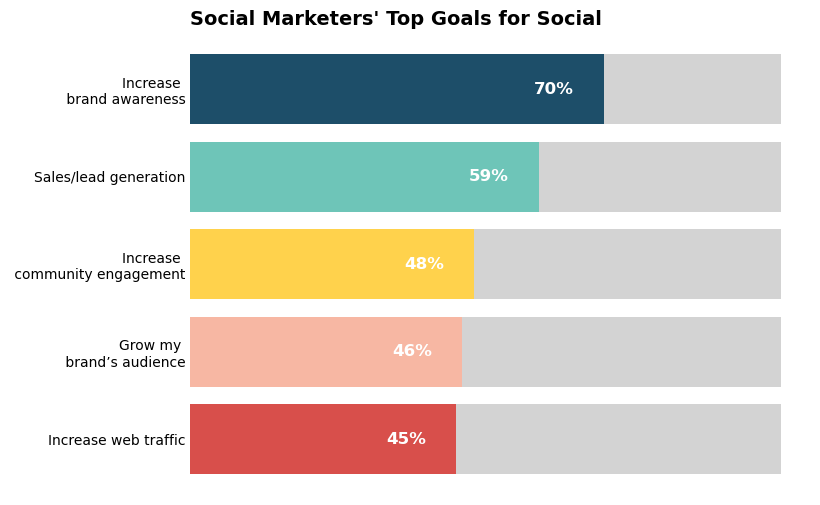
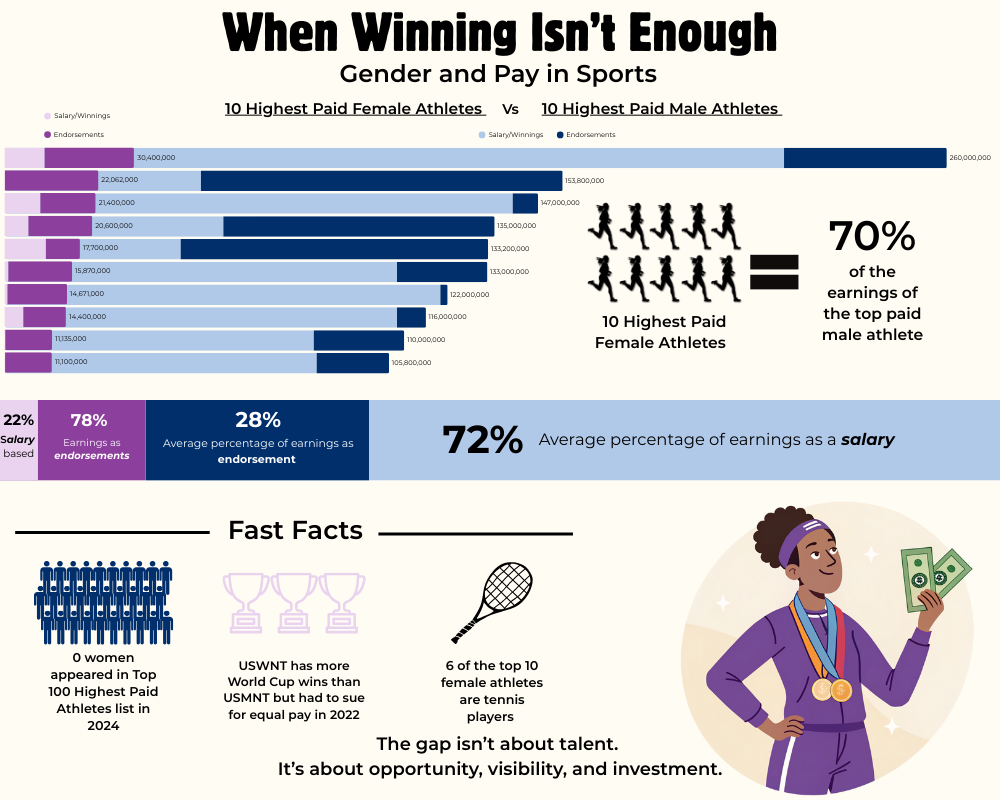
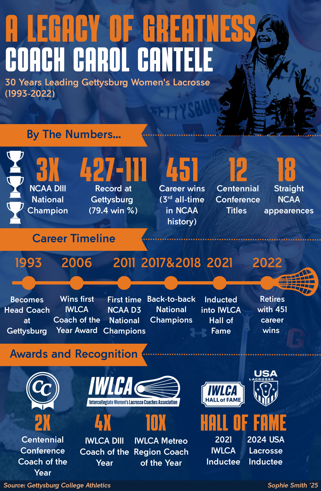

# DataVisualizationPortfolio
Welcome to my data visualization portfolio! Here, you'll find a collection of projects showcasing my skills in data analysis and visualization. Thanks for checking it out!

## About Me
Hi there! I'm a graduating senior from Gettysburg College, earning a Bachelor of Arts with a double major in Business, Organizations, and Management and Spanish, along with a minor in Data Science. I'm also a proud member of the women's lacrosse team and have been playing the sport for over a decade.

As both an athlete and student, I've developed strong leadership, teamwork, and problem-solving skills that I carry into every project I take on. I'm passionate about the intersection of business, marketing, social media, and sports—especially how data and storytelling can be used to drive strategy and engagement. I enjoy working with numbers, collaborating with others, and tackling real-world problems through creative and analytical thinking.

Looking ahead, I hope to build a career in business or marketing, and I’d love to stay involved in lacrosse through coaching. 

<!--Include links to documents or sites that may be useful to your target audience: website, LinkedIn, your cv/resume, github, a community you contribute to, etc -->

To learn more about me, you can visit my [personal website](your_web_address), my [github](https://github.com/YOURACCOUNT), or read my [CV](Images/CV.pdf).

---

## Social Media Marketing

<table align="right | left" style = "border-collapse: collapse; border: none;">
    <tr style = "border: none;">
        <td style="padding: 10px; width:25%; border: none;"> 
            
        </td>
        <td style="padding:10px; width:75%; border: none;" valign = "top">
            

            This project explores the different reasons that marketers are relying on social media marketing for their jobs. I’ve always been interested in social media marketing, especially considering how much more marketing we see through social media nowadays, so I was interested in seeing what the different purposes marketers were using social media for. The goal was to recreate the original radial bar graph into a horizontal bar graph for easier comparison between the different categories. 
<a href="./Project 1/README.md">Learn more</a>
              
            <i>Tools used: Python, Matplotlib</i>
            

        </td>
    </tr> 
</table>

## Gender Pay Gap in Sports

<table align="right | left" style = "border-collapse: collapse; border: none;">
    <tr style = "border: none;">
        <td style="padding: 10px; width:25%; border: none;"> 
            
        </td>
        <td style="padding:10px; width:75%; border: none;" valign = "top">
            

           This project explores the pay difference in professional sports between males and females. I was initially inspired to create this when I heard about Caitlin Clark’s rookie contract in the WNBA, and I was shocked to hear how little she was making from basketball alone. The goal of this project was to show how little the top paid females make in comparison to males, and how much more they have to rely on endorsements to earn money rather than the sport itself. 
<a href="./Project 2/README.md">Learn more</a>
              
            <i>Tools used: Canva, Recraft</i>
            

        </td>
    </tr> 
</table>

## The Legacy of Coach Cantele
<table align="right | left" style = "border-collapse: collapse; border: none;">
    <tr style = "border: none;">
        <td style="padding: 10px; width:25%; border: none;"> 
            
        </td>
        <td style="padding:10px; width:75%; border: none;" valign = "top">
            

            This project explores the accomplishments that Coach Cantele had, both individually and with the team, in her 30 years leading the Gettysburg Lacrosse program. I was inspired by Coach Cantele herself, as I was lucky enough to have her coach me in her last season at Gettysburg. The goal of the project was to display everything she accomplished to show the impact that she made while she was here.
 <a href="./Project 3/README.md">Learn more</a>
              
            <i>Tools used: Canva, ChatGPT(image creation)</i>
            

        </td>
    </tr> 
</table>
